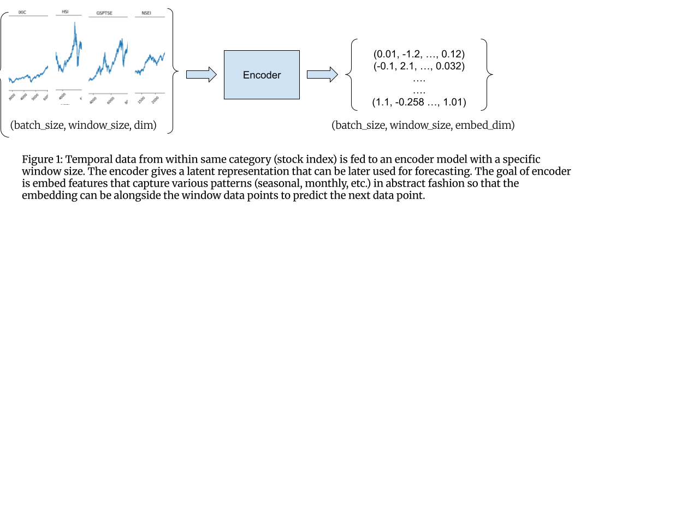
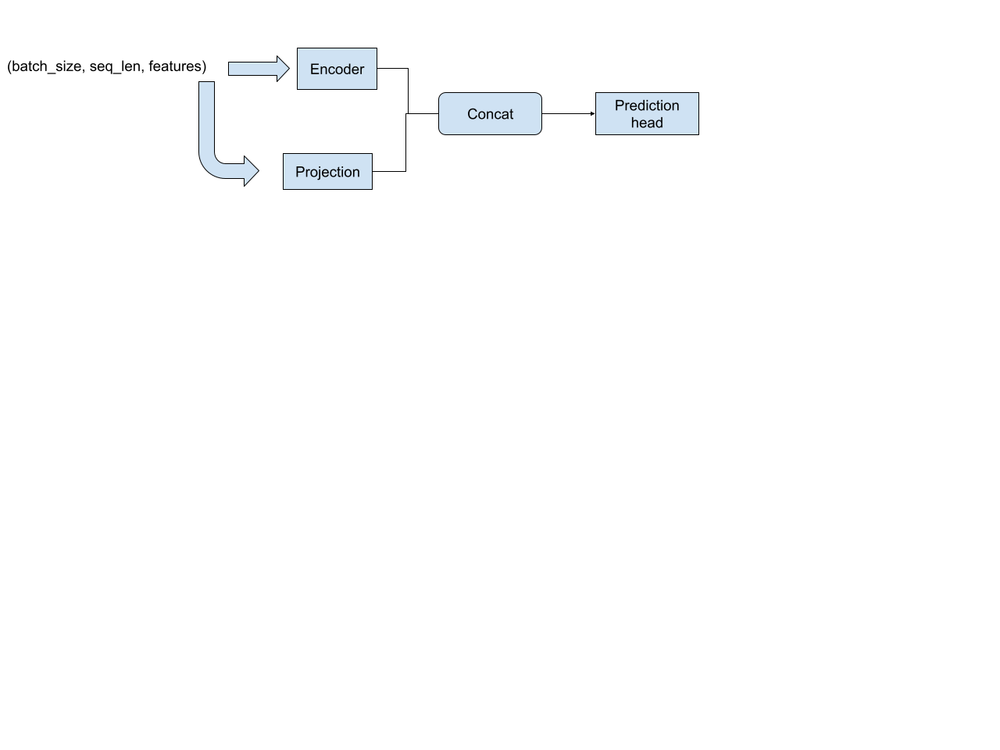
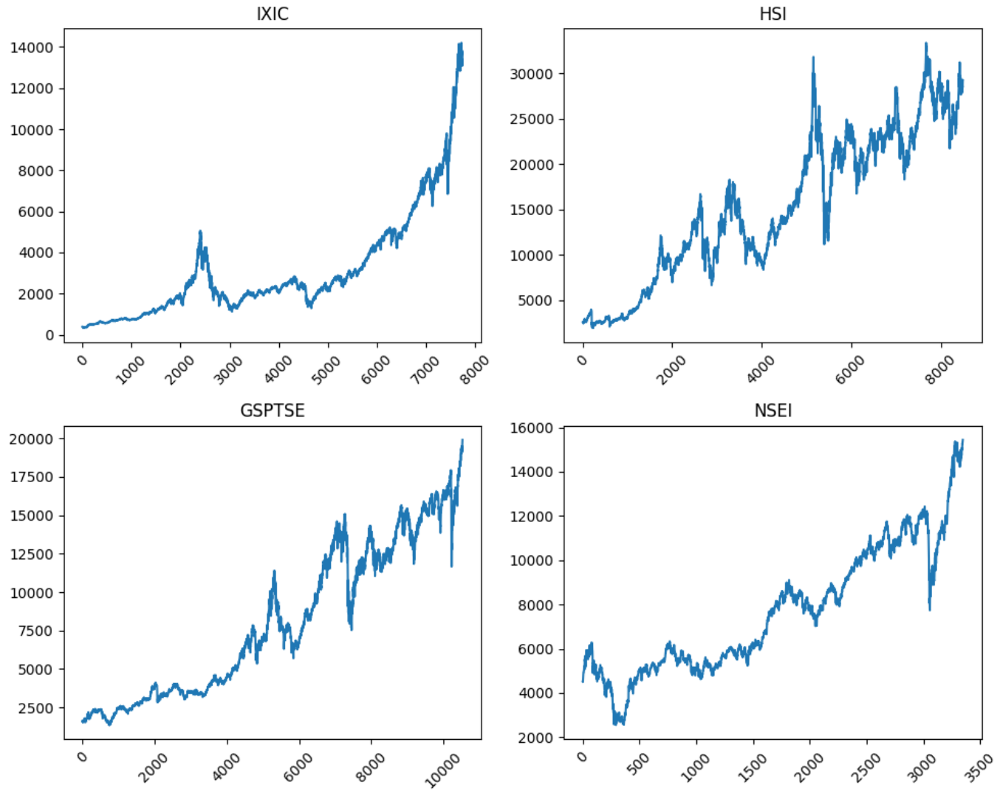

# Temporal Encoding

## Data

Temporal data related to data
1. [Index Data](https://www.kaggle.com/datasets/mattiuzc/stock-exchange-data)
2. [Crypto prices](https://www.kaggle.com/datasets/sudalairajkumar/cryptocurrencypricehistory)
3. [Tesla stock](https://www.kaggle.com/datasets/varpit94/tesla-stock-data-updated-till-28jun2021)

## Encoding

1. [Mamba](https://arxiv.org/pdf/2312.00752)
2. Mamba-transformer ([TransMamba](https://arxiv.org/pdf/2503.24067))
3. MoE Mamba 

## Hyper parameters

1. Window size
2. Embedding dimension

## Model architecture variatons

1. Width/Depth of encoder

2. Width/Depth of head

## Training Encoder

There are various ups and downs within temporal data. The goal is to train an encoder that captures an embedding that can be later used for forecasting.

## Questions
1. Can a representation-based model learn general time series info?
2. Could it train on stock and predict weather?
3. Could we combine stock and weather and predict using different prediction heads?
4. Can different attributes be treated as the original data? Train on stock price, then run on volume and close and then use it for representation?
5. Can we train volume, open, and other stock attributes as flat: no counting them as features but separate attributes then use the representation for training? Would it be more effective to use a separate encoder for each feature? Or maybe a MOE structure for mambalayer can diversify without the need for multiple encoder
